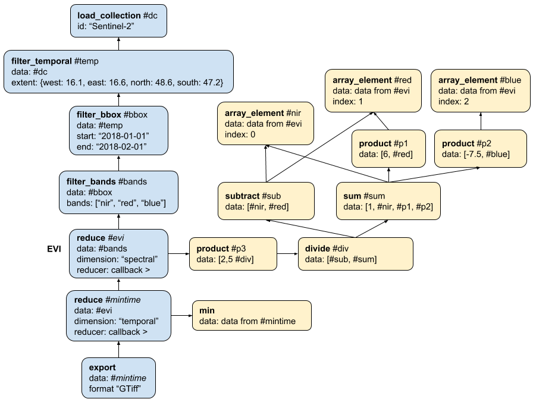

# Process graphs

A process graph is a chain of specific [processes](processes.md). Similarly to scripts in the context of programming, process graphs organize and automate the execution of one or more processes that could alternatively be executed individually. In a process graph, processes need to be specific, which means that concrete values for input parameters need to be specified. These arguments can again be process graphs (callbacks), scalar values, arrays, objects or variables.

## Schematic definition

A process graph is defined to be a map of connected processes with exactly one node returning the final result:

```
<ProcessGraph> := {
  <ProcessNodeIdentifier>: <ProcessNode>,
  ...
}
```

`<ProcessNodeIdentifier>` is a unique key within the process graph that is used to reference (the return value of) this process in arguments of other processes. The identifier is unique only within its own process graph, excluding any parent and child process graphs. Identifiers are also strictly scoped and can not be referenced from child or parent process graphs. Please note that circular references are not allowed.

Note: [Below you can find a JSON Schema for process graph validation](#process-graph-validation).

### Processes (Process Nodes)

A single node in a process graph (i.e. a specific instance of a process) is defined as follows:

```
<ProcessNode> := {
  "process_id": <string>,
  "description": <string>,
  "arguments": <Arguments>,
  "result": <boolean>
}
```
A process node MUST always contain key-value-pairs named `process_id` and `arguments` (see the next section). It MAY contain a `description`.

One of the nodes in a map of processes (the final one) MUST have the `result` flag set to `true`, all the other nodes can omit it as the default value is `false`.  This is important as multiple end nodes are possible, but in most use cases it is important to have exactly one end node, which can be referenced and the return value be used by other processes. Please note each callback also has a result node similar to the "main" process graph.

`process_id` can contain any of the process names defined by a back-end, which are all listed at `GET /processes`, e.g. `load_collection` to retrieve data from a specific collection for processing.

### Arguments

A process can have an arbitrary number of arguments. Their name and value are specified 
in the process specification as an object of key-value pairs:

```
<Arguments> := {
  <ParameterName>: <ArgumentValue>
}
```

The key `<ParameterName>` is RECOMMENDED to use [snake case](https://en.wikipedia.org/wiki/Snake_case) (e.g. `window_size` or `scale_factor`) and MUST limit the characters to letters (a-z), numbers and underscores.

A value is defined as follows:

```
<ArgumentValue> := <string|number|boolean|null|array|object|Callback|CallbackParameter|Result|Variable>
```

Notes:
- The specified value types, except `Callback`, `CallbackParameter`, `Result` and `Variable`, are the native data types supported by JSON. 
- Object-type values are not allowed to have keys with the following names:

    * `variable_id`, except for objects of type `Variable`
    * `from_argument`, except for objects of type `CallbackParameter`
    * `from_node`, except for objects of type `Result`

- A value of type `<Result>` is simply an object with a key `from_node` with a `<ProcessNodeIdentifier>` as value, which tells the back-end that the process expects the result (i.e. the return value) from another node to be passed as argument:

    ```
    <Result> := {
      "from_node": <ProcessNodeIdentifier>
    }
    ```

    Note that the `<ProcessNodeIdentifier>` is strictly scoped and can only referenced from within the same process graph, i.e. can not be referenced in child or parent process graphs.

- For `Variable`, `Callback` and `CallbackParameter` see the sections below.


**Important:** Arrays and objects can also contain any of the data types defined above for `<ArgumentValue>`. So back-ends must *fully* traverse the process graphs, including all children.


### Callbacks

A callback is a "child" process graph to be evaluated as part of another process.
A callback object (given as argument to its "parent" process) is a simple object with a single property `callback` that specifies a process graph:

```
<Callback> := {
  "callback": <ProcessGraph>
}
```

For example, you want to iterate over an array and calculate the absolute value of each value in the array.
You can do so by executing the `apply` process in openEO (often also called `map` in other languages) and pass the `absolute` process as callback, wrapped in a process graph.

The values passed from the "parent" process (`apply` in the example) to the "child" process (`absolute` in the example) are the *callback parameters*. 
You link them to the desired arguments of the child process through the `CallbackParameter` value type (similar to the `Result` type discussed above).
It is a simple object with key `from_argument` specifying the callback parameter name: 

```
<CallbackParameter> := {
  "from_argument": <CallbackParameterName>
}
```

The available callback parameter names (`<CallbackParameterName>`) are defined by the processes.
See the [`parameters` property](processes.md#callbacks) in the documentation or JSON schema of the callback argument of the process.

In case of the `apply-absolute` example, `apply` provides a callback parameter named `x` 
and `absolute` expects an argument with the same name coincidentally.
`loadcollection1` would be a result from another process (not defined in this example):

```
{
  "process_id": "apply",
  "arguments": {
    "data": {"from_node": "loadcollection1"}
    "process": {
      "callback": {
        "abs1": {
          "process_id": "absolute",
          "arguments: {
            "x": {"from_argument": "x"}
          },
          "result": true
        }
      }
    }
  }
}
```


Please note that the `<CallbackParameterName>` is also strictly scoped within the callback process graph and can not be referenced from other process graphs. 


### Variables

Process graphs can also hold a variable, which can be filled in later. For shared process graphs this can be useful to make them more portable, e.g in case a back-end specific product name would be stored with the process graph.

Variables are defined as follows:

```
<Variable> := {
  "variable_id": <string>,
  "description": <string>,
  "type": <string>,
  "default": <string|number|boolean|null|array|object>
}
```

The value for `type` is the expected data type for the content of the variable and MUST be one of `string` (default), `number`, `boolean`, `array` or `object`.

The value for `variable_id` is the name of the variable and can be any valid JSON key, but it is RECOMMENDED to use [snake case](https://en.wikipedia.org/wiki/Snake_case) and limit the characters to `a-z`, `0-9` and `_`.

Whenever no value for the variable is defined, the `default` value is used or the process graph is rejected if not default value has been specified.

## Example

Deriving minimum EVI (Enhanced Vegetation Index) measurements over pixel time series of Sentinel 2 imagery. The main process chain in blue, callbacks in yellow:



The process graph representing the algorithm:

``` json
{
  "dc": {
    "process_id": "load_collection",
    "description": "Loading the data; The order of the specified bands is important for the following reduce operation.",
    "arguments": {
      "id": "Sentinel-2",
      "spatial_extent": {
        "west": 16.1,
        "east": 16.6,
        "north": 48.6,
        "south": 47.2
      },
      "temporal_extent": ["2018-01-01", "2018-02-01"],
      "bands": ["B08", "B04", "B02"]
    }
  },
  "evi": {
    "process_id": "reduce",
    "description": "Compute the EVI. Formula: 2.5 * (NIR - RED) / (1 + NIR + 6*RED + -7.5*BLUE)",
    "arguments": {
      "data": {"from_node": "dc"},
      "dimension": "spectral",
      "reducer": {
        "callback": {
          "nir": {
            "process_id": "array_element",
            "arguments": {
              "data": {"from_argument": "data"},
              "index": 0
            }
          },
          "red": {
            "process_id": "array_element",
            "arguments": {
              "data": {"from_argument": "data"},
              "index": 1
            }
          },
          "blue": {
            "process_id": "array_element",
            "arguments": {
              "data": {"from_argument": "data"},
              "index": 2
            }
          },
          "sub": {
            "process_id": "subtract",
            "arguments": {
              "data": [{"from_node": "nir"}, {"from_node": "red"}]
            }
          },
          "p1": {
            "process_id": "product",
            "arguments": {
              "data": [6, {"from_node": "red"}]
            }
          },
          "p2": {
            "process_id": "product",
            "arguments": {
              "data": [-7.5, {"from_node": "blue"}]
            }
          },
          "sum": {
            "process_id": "sum",
            "arguments": {
              "data": [1, {"from_node": "nir"}, {"from_node": "p1"}, {"from_node": "p2"}]
            }
          },
          "div": {
            "process_id": "divide",
            "arguments": {
              "data": [{"from_node": "sub"}, {"from_node": "sum"}]
            }
          },
          "p3": {
            "process_id": "product",
            "arguments": {
              "data": [2.5, {"from_node": "div"}]
            },
            "result": true
          }
        }
      }
    }
  },
  "mintime": {
    "process_id": "reduce",
    "description": "Compute a minimum time composite by reducing the temporal dimension",
    "arguments": {
      "data": {"from_node": "evi"},
      "dimension": "temporal",
      "reducer": {
        "callback": {
          "min": {
            "process_id": "min",
            "arguments": {
              "data": {"from_argument": "data"}
            },
            "result": true
          }
        }
      }
    }
  },
  "save": {
    "process_id": "save_result",
    "arguments": {
      "data": {"from_node": "mintime"},
      "format": "GTiff"
    },
    "result": true
  }
}
```

## Remarks for back-end processing

To process the process graph on the back-end you need to go through all nodes/processes in the list and set for each node to which node it passes data and from which it expects data. In another iteration the back-end can find all start nodes for processing by checking for zero dependencies.

You can now start and execute the start nodes (in parallel if possible). Results can be passed to the nodes that were identified beforehand. For each node that depends on multiple inputs you need to check whether all dependencies have already finished and only execute once the last dependency is ready.

Please be aware that the result node (`result` set to `true`) is not necessarily the last node that is executed. The author of the process graph may choose to set a non-end node to the result node!

### Process graph validation

Process graph validation is a quite complex task. Below you can find a process graph JSON schema for basic validation. It checks the general structure of a process graph, but only checking against the schema is not fully validating a process graph. Note that this JSON Schema is probably good enough for a first version, but should be revised and improved for production. There are further steps to do:

1. Validate whether there's exactly one `result: true` per process graph.
2. Check whether the process names that are referenced in the field `process_id` are actually available. There's a custom format `process-id`, which can be used to check the value directly during validation against the JSON Schema.
3. Validate all arguments for each process against the JSON schemas that are specified in the corresponding process specifications.
4. Check whether the values specified for `from_node` have a corresponding node in the same process graph.
5. Validate whether the return value and the arguments requesting a return value with `from_node` are compatible.
6. Validate whether the data types of process graph variables are compatible to the JSON schema of the parameters.
7. Check the content of arrays and objects. These could include variables and other references (`from_node`, `from_argument` etc.). Note that this is a very complex validation step and [still under discussions in issue #183](https://github.com/Open-EO/openeo-api/issues/183).

```json
{
  "$schema":"http://json-schema.org/draft-07/schema#",
  "title":"Process Graph",
  "description":"A process graph defines a graph-like structure as a connected set of executable processes. Each key is a unique identifier (node id) that is used to refer to the process in the graph.",
  "allOf":[
    {
      "$ref":"#/definitions/process_graph"
    }
  ],
  "definitions":{
    "process_graph":{
      "title":"Process Graph",
      "type":"object",
      "additionalProperties":{
        "$ref":"#/definitions/process_node"
      }
    },
    "process_node":{
      "title":"Process Node",
      "type":"object",
      "required":[
        "process_id",
        "arguments"
      ],
      "properties":{
        "process_id":{
          "$ref":"#/definitions/process_id"
        },
        "result":{
          "type":"boolean",
          "default":false
        },
        "description":{
          "type":[
            "string",
            "null"
          ]
        },
        "arguments":{
          "$ref":"#/definitions/process_arguments"
        }
      }
    },
    "process_arguments":{
      "title":"Process Arguments",
      "type":"object",
      "additionalProperties":{
        "$ref":"#/definitions/process_argument_value"
      }
    },
    "process_argument_value":{
      "title":"Process Argument Value",
      "anyOf":[
        {
          "type":"null"
        },
        {
          "type":"object",
          "title":"Object"
        },
        {
          "type":"string",
          "title":"String"
        },
        {
          "type":"number",
          "title":"Number (incl. integers)"
        },
        {
          "type":"boolean",
          "title":"Boolean"
        },
        {
          "type":"array",
          "title":"Array",
          "items":{
            "$ref":"#/definitions/process_argument_value"
          }
        },
        {
          "$ref":"#/definitions/variable"
        },
        {
          "type":"object",
          "title":"Result",
          "required":[
            "from_node"
          ],
          "properties":{
            "from_node":{
              "type":"string"
            }
          },
          "additionalProperties":false
        },
        {
          "type":"object",
          "title":"Callback Parameter",
          "required":[
            "from_argument"
          ],
          "properties":{
            "from_argument":{
              "type":"string"
            }
          },
          "additionalProperties":false
        },
        {
          "type":"object",
          "title":"Callback",
          "required":[
            "callback"
          ],
          "properties":{
            "callback":{
              "$ref":"#/definitions/process_graph"
            }
          },
          "additionalProperties":false
        }
      ]
    },
    "variable":{
      "title":"Process Graph Variable",
      "type":"object",
      "required":[
        "variable_id"
      ],
      "properties":{
        "variable_id":{
          "type":"string"
        },
        "type":{
          "type":"string",
          "enum":[
            "string",
            "number",
            "integer",
            "boolean",
            "array",
            "object"
          ],
          "default":"string"
        },
        "description":{
          "type":[
            "string",
            "null"
          ]
        },
        "default":{
          "anyOf":[
            {
              "type":"null"
            },
            {
              "type":"object"
            },
            {
              "type":"string"
            },
            {
              "type":"number"
            },
            {
              "type":"array",
              "items":{
                "description": "Any type is allowed."
              }
            },
            {
              "type":"boolean"
            },
            {
              "$ref":"#/definitions/process_graph"
            }
          ]
        }
      }
    },
    "process_id":{
      "type":"string",
      "format":"process-id",
      "pattern":"^[A-Za-z0-9_]+$"
    }
  }
}
```